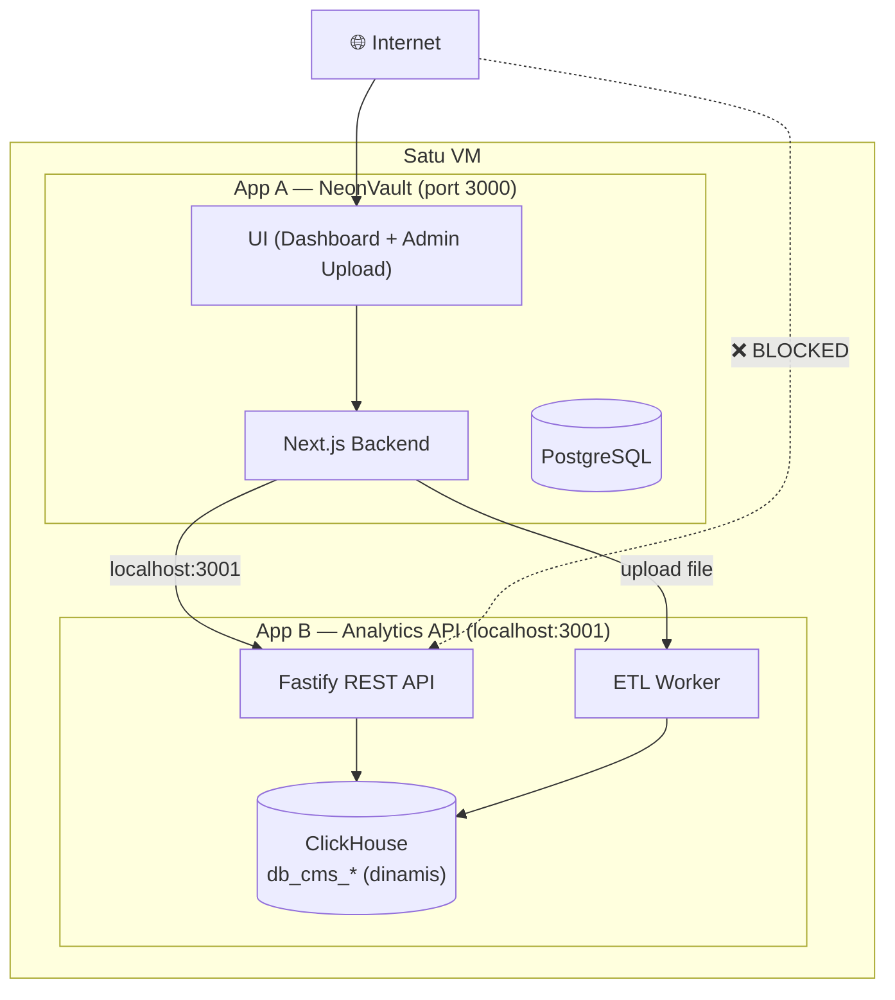
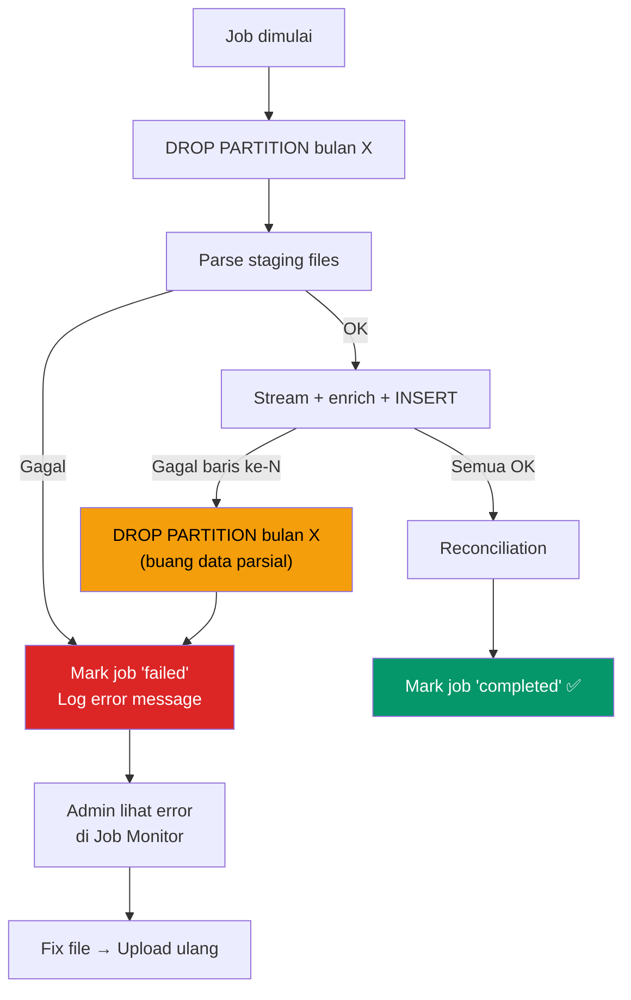

# Blueprint Arsitektur: Central Analytics API (App B) — FINAL v2

> Ekosistem Agregator Musik — ClickHouse Analytics Engine  
> Status: ✅ Semua keputusan arsitektur terkonfirmasi

---

## Arsitektur Sistem



---

## Pemetaan Kolom (Sumber Kebenaran)

> [!IMPORTANT]
> **Revenue, views, dan identifier (asset_id, isrc, upc) selalu dari Claim Raw.**

| Kolom | Sumber | Key Lookup |
|-------|--------|:----------:|
| `report_type`, `label_source` | Diisi saat ingestion | — |
| `adjustment_type`, `day`, `country` | ① Claim Raw | — |
| `video_id`, `channel_id` | ① Claim Raw | — |
| `asset_id`, `asset_channel_id`, `asset_type` | ① Claim Raw | — |
| `content_type`, `policy`, `claim_type`, `claim_origin` | ① Claim Raw | — |
| `custom_id`, `isrc`, `upc`, `grid` | ① Claim Raw | — |
| `owned_views` + 10 kolom revenue | ① Claim Raw | — |
| `video_title`, `video_duration_sec` | ② Claim Summary | by `video_id` |
| `username`, `uploader`, `channel_display_name` | ② Claim Summary | by `video_id` |
| `multiple_claims`, `category` | ② Claim Summary | by `video_id` |
| `asset_labels` | ② Claim Summary | by `video_id` |
| `artist`, `asset_title`, `album`, `label` | ③ Asset Summary | by `isrc` |

> Jika ISRC kosong → metadata musik (artist, album, label) **dibiarkan kosong**. Tidak ada fallback.
> `label` = nama label (Sony, Warner). `asset_labels` = marker internal CMS grouping kepemilikan.

---

## Tabel ClickHouse

### `ads_revenue_enriched`

```sql
CREATE TABLE IF NOT EXISTS ads_revenue_enriched (
    -- Metadata
    report_type          LowCardinality(String) DEFAULT 'claim_raw'
                         COMMENT 'claim_raw | ads_adjustment | sub_adjustment',
    label_source         LowCardinality(String) DEFAULT 'report'
                         COMMENT 'report | reconciled | corrected',
    -- Dari Claim Raw (master)
    adjustment_type      LowCardinality(String) DEFAULT '',
    day                  Date,
    country              LowCardinality(String),
    video_id             String,
    channel_id           String,
    asset_id             String,
    asset_channel_id     String        DEFAULT '',
    asset_type           LowCardinality(String),
    content_type         LowCardinality(String),
    policy               LowCardinality(String),
    claim_type           LowCardinality(String),
    claim_origin         LowCardinality(String),
    custom_id            String        DEFAULT '',
    isrc                 String        DEFAULT '',
    grid                 String        DEFAULT '',
    upc                  String        DEFAULT '',
    -- Enriched dari Claim Summary (by video_id)
    video_title          String        DEFAULT '',
    video_duration_sec   UInt32        DEFAULT 0,
    username             String        DEFAULT '',
    uploader             String        DEFAULT '',
    channel_display_name LowCardinality(String) DEFAULT '',
    multiple_claims      LowCardinality(String) DEFAULT '',
    category             LowCardinality(String) DEFAULT '',
    asset_labels         String        DEFAULT ''
                         COMMENT 'Marker internal CMS untuk grouping kepemilikan',
    -- Enriched dari Asset Summary (by isrc)
    artist               String        DEFAULT '',
    asset_title          String        DEFAULT '',
    album                String        DEFAULT '',
    label                LowCardinality(String) DEFAULT ''
                         COMMENT 'Nama label/publisher (Sony, Warner)',
    -- Revenue (selalu dari Claim Raw)
    owned_views                        UInt64       DEFAULT 0,
    yt_rev_auction                     Decimal64(6) DEFAULT 0,
    yt_rev_reserved                    Decimal64(6) DEFAULT 0,
    yt_rev_partner_sold_yt_served      Decimal64(6) DEFAULT 0,
    yt_rev_partner_sold_p_served       Decimal64(6) DEFAULT 0,
    yt_rev_total                       Decimal64(6) DEFAULT 0,
    partner_rev_auction                Decimal64(6) DEFAULT 0,
    partner_rev_reserved               Decimal64(6) DEFAULT 0,
    partner_rev_partner_sold_yt_served Decimal64(6) DEFAULT 0,
    partner_rev_partner_sold_p_served  Decimal64(6) DEFAULT 0,
    partner_rev_total                  Decimal64(6) DEFAULT 0,
    ingested_at          DateTime      DEFAULT now()
)
ENGINE = ReplacingMergeTree(ingested_at)
PARTITION BY toYYYYMM(day)
ORDER BY (day, report_type, asset_id, video_id, channel_id, country, claim_type)
SETTINGS index_granularity = 8192;
```

### `subscription_revenue`

```sql
CREATE TABLE IF NOT EXISTS subscription_revenue (
    adjustment_type      LowCardinality(String) DEFAULT '',
    day                  Date,
    country              LowCardinality(String),
    video_id             String,
    video_channel_id     String        DEFAULT '',
    asset_id             String,
    asset_channel_id     String        DEFAULT '',
    asset_title          String        DEFAULT '',
    asset_labels         String        DEFAULT ''
                         COMMENT 'Marker internal CMS',
    asset_type           LowCardinality(String),
    custom_id            String        DEFAULT '',
    isrc                 String        DEFAULT '',
    upc                  String        DEFAULT '',
    grid                 String        DEFAULT '',
    artist               String        DEFAULT '',
    album                String        DEFAULT '',
    label                LowCardinality(String) DEFAULT ''
                         COMMENT 'Nama label/publisher',
    claim_type           LowCardinality(String),
    content_type         LowCardinality(String),
    offer                LowCardinality(String) DEFAULT '',
    owned_views                  UInt64    DEFAULT 0,
    monetized_views_audio        UInt64    DEFAULT 0,
    monetized_views_audiovisual  UInt64    DEFAULT 0,
    monetized_views_total        UInt64    DEFAULT 0,
    yt_rev_total                 Decimal64(6) DEFAULT 0,
    partner_rev_pro_rata         Decimal64(6) DEFAULT 0,
    partner_rev_per_sub_min      Decimal64(6) DEFAULT 0,
    partner_rev_total            Decimal64(6) DEFAULT 0,
    ingested_at          DateTime      DEFAULT now()
) ENGINE = MergeTree()
PARTITION BY toYYYYMM(day)
ORDER BY (day, asset_id, video_id, country);
```

### Tabel Pendukung

```sql
-- Registrasi CMS dinamis (di default DB)
CREATE TABLE cms_registry (
    cms_id String, cms_name String, db_name String,
    api_key_hash String, is_active UInt8 DEFAULT 1,
    created_at DateTime DEFAULT now()
) ENGINE = ReplacingMergeTree(created_at) ORDER BY (cms_id);

-- Channel → label mapping (per CMS database)
CREATE TABLE channel_label_map (
    channel_id String, asset_label String,
    cms_name LowCardinality(String), notes String DEFAULT '',
    updated_at DateTime DEFAULT now()
) ENGINE = ReplacingMergeTree(updated_at) ORDER BY (channel_id);

-- Job tracking (per CMS database)
CREATE TABLE ingestion_jobs (
    job_id       String,
    job_type     LowCardinality(String)
                 COMMENT 'ads_revenue | subscription | reconciliation',
    status       LowCardinality(String) DEFAULT 'pending'
                 COMMENT 'pending | processing | completed | failed',
    month        UInt32  COMMENT 'YYYYMM format, e.g. 202601',
    total_rows   UInt64  DEFAULT 0,
    processed_rows UInt64 DEFAULT 0,
    error_message String DEFAULT '',
    started_at   DateTime DEFAULT now(),
    completed_at Nullable(DateTime)
) ENGINE = MergeTree()
ORDER BY (job_id);

-- Unified view
CREATE VIEW v_unified_revenue AS
SELECT day, video_id, asset_id, country,
       'ads' AS revenue_source, report_type AS sub_source,
       owned_views, yt_rev_total, partner_rev_total
FROM ads_revenue_enriched
UNION ALL
SELECT day, video_id, asset_id, country,
       'subscription', 'subscription',
       owned_views, yt_rev_total, partner_rev_total
FROM subscription_revenue;

-- Materialized View: pre-agregasi harian
CREATE MATERIALIZED VIEW mv_daily_summary
ENGINE = SummingMergeTree()
ORDER BY (day, report_type)
AS SELECT
    day,
    report_type,
    count()              AS total_rows,
    sum(owned_views)     AS total_views,
    sum(yt_rev_total)    AS total_yt_revenue,
    sum(partner_rev_total) AS total_partner_revenue
FROM ads_revenue_enriched
GROUP BY day, report_type;
```

---

## ETL Pipeline & Error Handling

### Alur Ingestion

```
Admin upload via App A:
  1. App A forward file ke App B
  2. App B buat job di ingestion_jobs (status='pending')
  3. DROP PARTITION bulan X (bersihkan data lama + adjustment)
  4. Parse staging: videoclaim → Map, asset_summary → Map
  5. Stream claim_raw → enrich → batch INSERT 50K rows
  6. (opsional) Stream adjustment → enrich → INSERT
  7. Auto reconciliation (fix null labels)
  8. OPTIMIZE TABLE FINAL
  9. Update job status → 'completed'
```

### Error Handling: "Clean Slate"



> Tidak ada retry otomatis. Upload bulanan: admin perlu tahu penyebab error sebelum coba lagi.

---

## Admin Features

| Fitur | Fungsi |
|-------|--------|
| Channel Label Mapping | Daftarkan rollup channel → fix null labels |
| Asset Label Correction | Fix label salah (per asset_id / bulk CSV) |
| Job Monitor | Progress ingestion, error logs |
| CMS Registry | Tambah/hapus CMS (auto-create DB, user, role) |

---

## API Endpoints Fase 1

| Method | Path | Fungsi |
|--------|------|--------|
| GET | `/api/v1/revenue/daily?month=` | Revenue harian (line chart) |
| GET | `/api/v1/views/daily?month=` | Views harian (line chart) |
| GET | `/api/v1/analytics/top-assets?month=` | Top lagu by revenue |
| GET | `/api/v1/analytics/top-videos?month=` | Top video by revenue |
| GET | `/api/v1/analytics/top-channels?month=` | Top channel by revenue |
| GET | `/api/v1/analytics/by-country?month=` | Sebaran per negara |
| GET | `/api/v1/analytics/by-label?month=` | Revenue per label |
| POST | `/api/v1/ingest/ads-revenue` | Upload 3-5 file → ETL |
| POST | `/api/v1/ingest/subscription` | Upload subscription |
| GET | `/api/v1/ingest/jobs/:id` | Status job |
| CRUD | `/api/v1/admin/channel-map` | Channel label mapping |
| CRUD | `/api/v1/admin/cms-registry` | Registrasi CMS |
| POST | `/api/v1/admin/correct-label` | Koreksi label |

---

## Cross-CMS & Music Video Tracking

**Fase 1:** Query by `ISRC`/`UPC` — MV tanpa UPC belum ter-cover.
**Fase 2:** Filter by `channel_id` → tampilkan MV tanpa label → staff mapping manual.

---

## Tech Stack & Deployment

| Komponen | Pilihan |
|----------|---------|
| Framework | Node.js + Fastify |
| Database | ClickHouse 24.8 |
| Deploy | Satu VM (localhost:3001) |
| UI | Semua di App A (App B headless) |

```yaml
services:
  clickhouse:
    image: clickhouse/clickhouse-server:24.8-alpine
    ports: ["127.0.0.1:8123:8123", "127.0.0.1:9000:9000"]
    volumes: [ch_data:/var/lib/clickhouse]
    deploy: { resources: { limits: { memory: 3G } } }
  analytics-api:
    build: .
    ports: ["127.0.0.1:3001:3001"]
    env_file: .env
```

| Resource | Rekomendasi |
|----------|:---:|
| CPU | 8 core |
| RAM | 16 GB |
| Disk | 200 GB NVMe SSD |

---

## Peta Jalan

| Fase | Fokus |
|------|-------|
| **1. Foundation** | Setup App B + ClickHouse + DDL + RBAC |
| **2. Ingestion** | ETL enrichment + reconciliation + error handling |
| **3. API** | 7 endpoint analytics + admin CRUD |
| **4. Integrasi** | UI upload + dashboard grafik di App A |
| **5. Polish** | Logging, job monitor, production config |
| **6. Future** | MV anomali report, partner onboarding |
